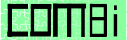

Combi is a [parser combinator](https://en.wikipedia.org/wiki/Parser_combinator) library for the [Dart programming language](https://en.wikipedia.org/wiki/Dart_(programming_language)).

## Credits

- The logo is based on a modified version of a public domain jigsaw puzzle vector from [Public Domain Vectors](https://publicdomainvectors.org/en/free-clipart/Puzzle-template/41005.html).
